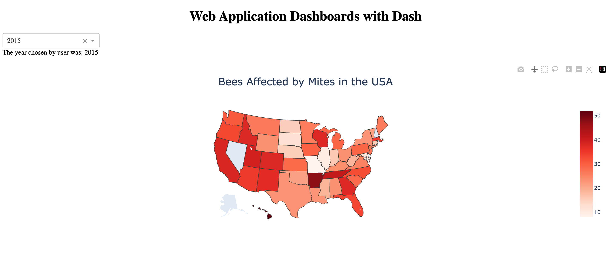
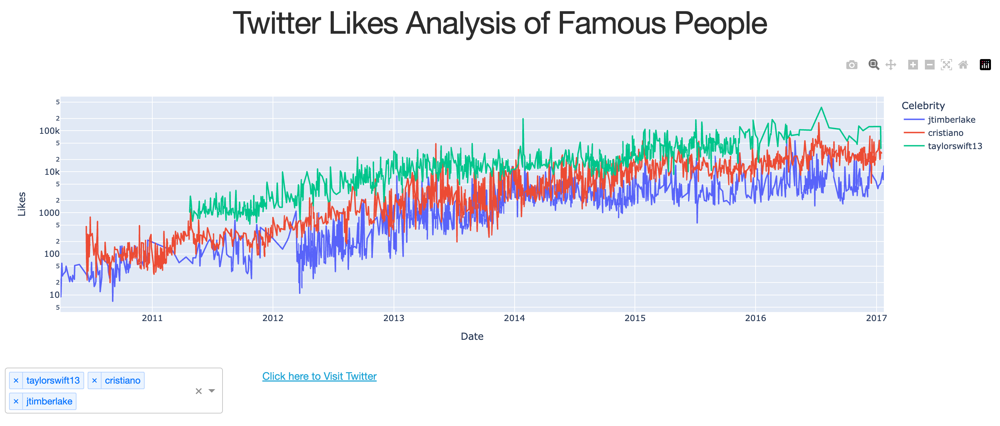

# Bee Populations and Twitter Likes Dashboards

Welcome to the Bee Populations and Twitter Likes Dashboards repository! This project contains two interactive Dash dashboards created using Python: one visualizes bee populations affected by Varroa mites, and the other displays the Twitter likes of famous people over time.

## Bee Populations Dashboard

The Bee Populations Dashboard presents data on bee populations impacted by Varroa mites across different states in the USA. Users can select a year from the dropdown menu to view the percentage of bee colonies affected by Varroa mites for that specific year.

## Famous People's Twitter Likes Dashboard

The Famous People's Twitter Likes Dashboard analyzes the likes received by famous individuals on Twitter over time. Users can choose multiple celebrities from the dropdown menu to compare their likes trends.

### Usage

1. Clone the repository to your local machine.
2. Install the required packages using `pip install -r requirements.txt`.
3. Run each dashboard script (`bee_populations_dashboard.py` and `twitter_likes_dashboard.py`) using Python.
4. Access the dashboards in your web browser using the provided URLs.

### Dependencies

- pandas
- plotly
- dash

### How to Contribute

1. Fork the repository.
2. Create a new branch (`git checkout -b feature/new-feature`).
3. Make your changes and commit them (`git commit -am 'Add new feature'`).
4. Push to the branch (`git push origin feature/new-feature`).
5. Create a new Pull Request.

Feel free to open an issue if you encounter any problems or have suggestions for improvement.

